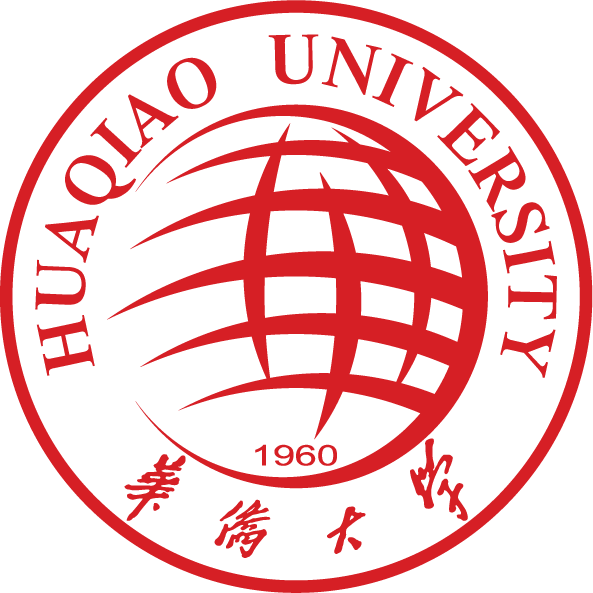
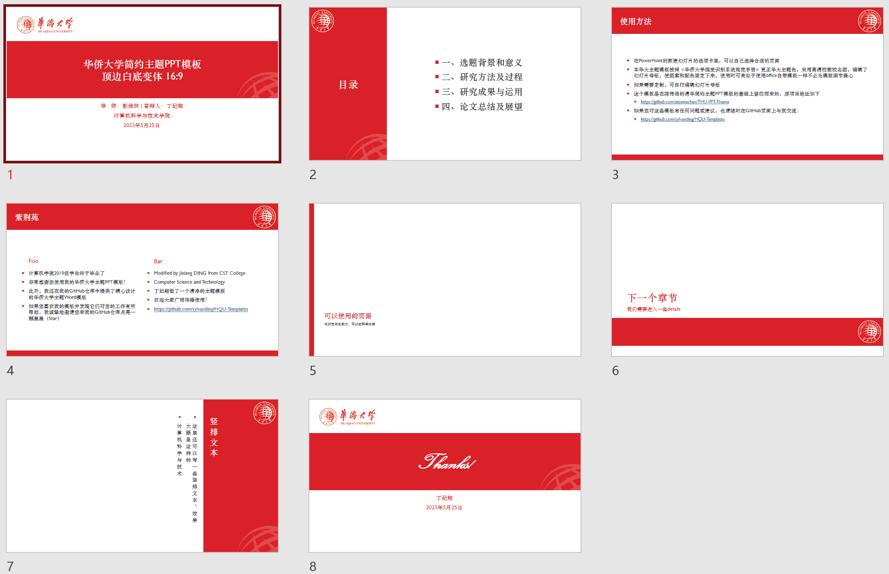
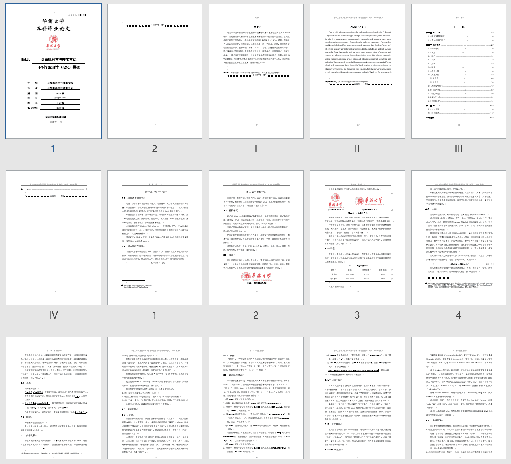

  
  <h1 align="center"><a href="https://github.com/sylvanding/HQU-Templates" target="_blank" style="text-decoration: none; color: inherit;">华侨大学主题模版</a></h1>
  
适用于 课程作业、实验报告、项目策划、毕业论文、毕设答辩...

**这是一个非官方项目，仅供个人学习研究。**

---

## 🚀 指南

### 📖 仓库简介

该仓库提供了一系列适用于课程作业、实验报告、项目策划、毕业论文、毕设答辩等场景的**华侨大学主题学术模版**，包括：

- 华侨大学简约主题PPT模板-v3顶边白底16-9.pptx
- 华侨大学计算机科学与技术学院本科毕业设计（论文）Word模版.dotm
- 华侨大学课程作业和实验报告简易模版.docx

这些模版经过相应的修改和调整，一定程度上满足了华侨大学的学术写作规范。您也可以根据个人需求进行定制，以满足不同学校和院系的要求。

### ⚙️ 使用环境

文档编辑软件为`Windows`操作系统下的`Office 2021`，不同软件、平台、Microsoft Office版本可能导致页面的最终呈现结果有所不同。

### 📥 下载安装

- GitHub：通过[Release页面下载](https://github.com/sylvanding/HQU-Templates/releases)华侨大学主题模版，选择最新的模版版本。下载完成后，您可以在本地计算机上解压相应的模版文件并通过`Office 2021`套件查看和编辑这些模版。
- 华大云盘：[点击下载]()

## ✨ 特色

### 简约主题PPT模板

基于[陈伟浩的清华简约主题PPT模板](https://github.com/atomiechen/THU-PPT-Theme)进行修改，按照《华侨大学视觉识别系统规范手册》的要求，更正了华大的主题色，并采用了高清校徽校名图。通过编辑幻灯片母版，使得图案和配色固定下来。**该PPT模版适用于学术论文答辩等场合。**

### 本科毕业设计（论文）Word模版

参考了[《清华大学本科学位论文Word模板》](https://github.com/qbh16/ThuWordThesis)（以下简称《清华论文模版》），并根据华侨大学计算机学院的写作要求和规范进行适当修改。此模版进一步明确了论文格式调整的流程，并补充了《清华论文模版》中未涉及的细节问题，包括：

- 参考文献的插入与排序
- 奇偶页眉页脚的设置
- 题注编号修正
- 目录生成与修改
- 论文封面插入
- 高质量PDF生成
- Word软件配置

### 课程作业和实验报告简易模版

提供了一个简洁易用的模版，适用于各类作业和比赛项目策划书的撰写。该模版旨在极大简化写作格式的调整流程，同时满足一定的学术规范。

## ❤️ 感谢

感谢[陈伟浩的清华简约主题PPT模板](https://github.com/atomiechen/THU-PPT-Theme)以及[《清华论文模板》](https://github.com/qbh16/ThuWordThesis)，为我们提供了优秀的样例参考。

## 📢 声明

该仓库中的模版仅供学术和教育目的使用。使用者应自行负责验证和适应模版内容以符合他们的具体要求。仓库维护者不对使用模版造成的任何损失或问题负责。如有任何疑问，请寻求相关专业人士的建议。**一旦使用本模版，即表示同意接受本免责声明的所有条款和条件。**

## 📧 联系

如有任何问题或疑问，请联系仓库维护者：

- 姓名：丁纪翔
- 电子邮件：sylvanding@qq.com

## License

MIT